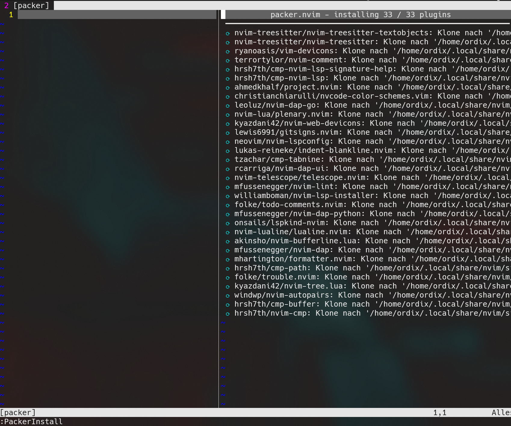
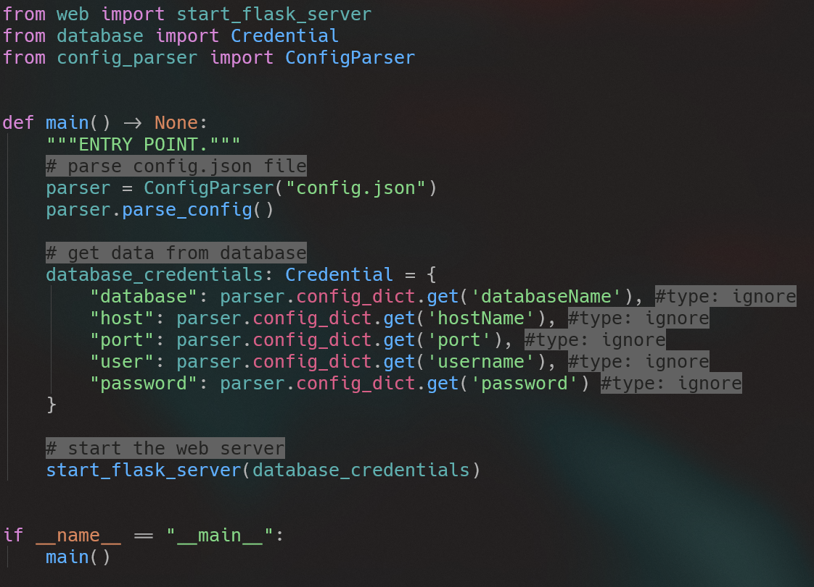
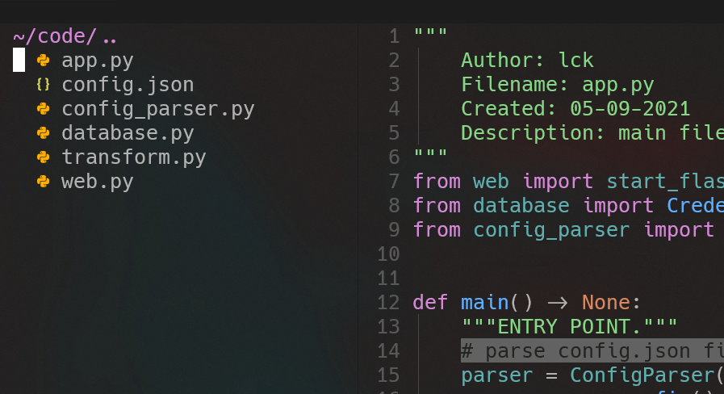

# Neovim Workshop

## 1. Get on the system
1. Groups of 2
2. Login credentials are written on the paper in front of you. (Please don't move them)
3. Open your Terminal (Windowsterminal -> Powershell or WSL)
3. Login into ssh
    ```bash
    $ ssh <user-from-paper>@<ip-from-paper>
    ```

## 2. Initial Login
1. Open Neovim for the first time. (This can take some time)
    ```bash
    $ nvim
    ```
2. Press enter to skip the Warning about the colortheme.
3. Press `:` on your keyboard. Then type PackerInstall in the opened text input on the left bottom of your screen.
4. Press Enter. A window split should open up. 
    
5. Wait until the header changes to `packer.nvim - finished in ...`
    * Don't care about the erros. The are fixed automatically when reopening nvim.
6. To close the window split press `q` on your keyboard.
7. To leave nvim type `:q`

## 3. Open some code
1. Enter the following command in your terminal: `nvim ~/code/app.py`
    * Skip the following warning by pressing enter. This will be fixed automatically.
2. Wait some time till `4/4 Treitter parser for python has been installed`.
3. Restart nvim with `:q` and `nvim ~/code/app.py`.
    * After restarting syntax highlighting should be applied.
    

## 4. General information
* Normal mode (moving arround like a god mode but not allowed to write)
    * Is active when `NORMAL` is displayed in the statusline at the bottom.
    * You can allways switch to NORMAL mode pressing: `ESC`

* Insert mode (writing like goethe but not allowed to move arround)
    * Is active when `INSERT` is displayed in the statusline at the bottom.
    * You can allways switch from NORMAL to INSERT mode pressing: `i`
    * ⚠ Reminder: `ESC` gets you back to NORMAL mode

* You can move the cursor using the following keys (NORMAL mode only):
    * h -> left
    * j -> down
    * k -> up
    * l -> right

## 5. Working with Neovim
### 5.1 Working with the file explorer
    * With in neovim press `SPACE e`. You need to press them both at the same time, but SPACE must be one milisecond faster. Otherwise the order will be `e SPACE` which is wrong.
    * A new window split should be opened.
        
    * In the previous picture you can spot a white bar in the left top corner. That shows you are focusing the file explorer window. Which is needed. If this is not the case you can click with your mouse inside the tree window. 
    * With the keys you can navigate up and down.
        * j -> down
        * k -> up
    * To open a file simply press v (vertical split) with the cursor on that specific file.
